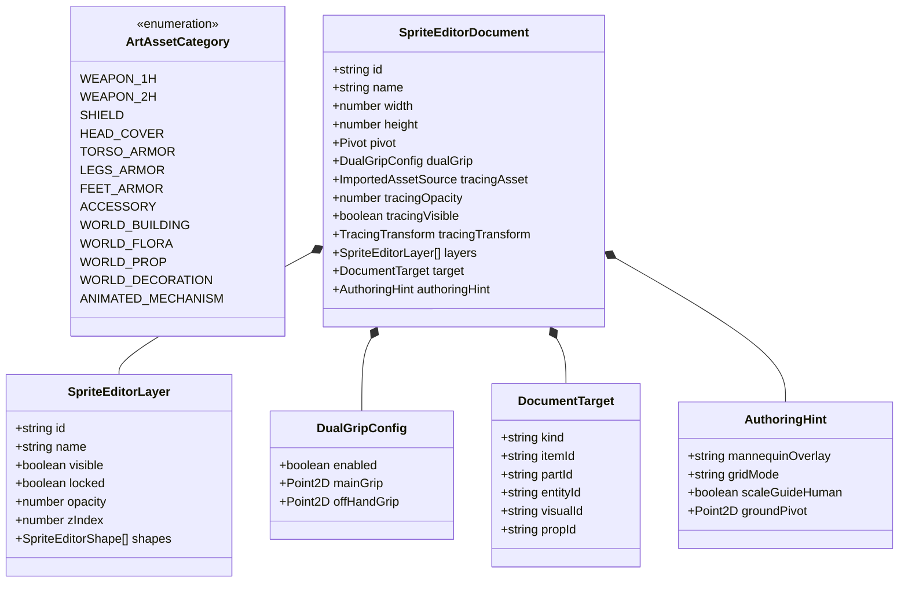
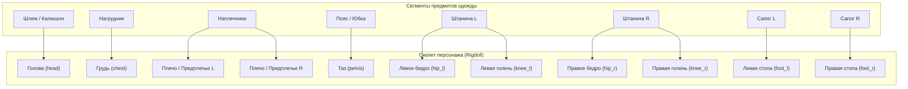
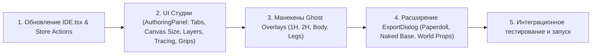

# Полная техническая спецификация: Универсальная векторная арт-студия и система создания игрового контента (Asset Composer)

**Версия документа:** 2.0 (Master Blueprint)  
**Статус:** Согласовано / Двойная проверка пройдена / Готово к реализации  
**Область применения:** `Asset Composer` (IDE, Canvas Vector Engine, Rigdoll Skeleton, Export Pipeline)

---

## 1. Введение и концептуальное видение

### 1.1. Проблема
В базовой версии редактора рисование было жестко связано с частями тела персонажа и оверлеями лица (`bodyPart`, `facePart`). В редакторе отсутствовал функционал для рисования:
1. **Предметов экипировки:** Оружия (одноручного, двуручного), щитов, шлемов, доспехов, штанов, сапог.
2. **Объектов окружающего мира:** Зданий, гор, деревьев, камней, цветов, сундуков, декораций (как статичных, так и анимированных).
3. **Автономного режима:** Возможности открыть чистый холст произвольного разрешения, загрузить любую картинку для срисовки (подложку) и создавать игровой арт с нуля.

### 1.2. Решение
Архитектура **Универсальной студии векторного арта (Vector Art Studio)** расширяет редактор до полноценной среды производства 2D-графики для игр. Студия объединяет:
- **Свободный холст** с гибким разрешением (от $32\times32$ для иконок до $1024\times1024+$ для замков и локаций).
- **Продвинутый стек слоев** (видимость, блокировка, прозрачность 0–100%, порядок Z-Index).
- **Инструмент подложки (Tracing Reference)** для загрузки любых изображений с плавным диммированием и быстрым скрытием (`H`).
- **Манекены персонажа (Ghost Overlays)** для точной подгонки одежды под скелет (`Rigdoll`) и позиционирования хвата оружия (Single-Grip и Dual-Grip с Two-Bone IK).
- **Прямой авторский цвет (WYSIWYG)** без принудительной подмены палитры.
- **Универсальный экспорт:** голый персонаж, модульные накладки (Paperdoll для инвентаря RPG), композитные спрайтшиты и пропы мира с метаданными точек опоры (Ground Pivot).

---

## 2. Архитектура сущностей и моделей данных



### 2.1. Доменные типы (`src/domain/types.ts`)

```typescript
// Категории игрового арта
export type ArtCategory =
  | "weapon_1h"           // Одноручные мечи, кинжалы, топоры, булавы, жезлы
  | "weapon_2h"           // Копья, двуручные мечи, луки, посохи, алебарды
  | "shield"              // Щиты, баклеры
  | "head_cover"          // Шлемы, капюшоны, короны, маски
  | "torso_armor"         // Кирасы, кольчуги, мантии, куртки
  | "legs_armor"          // Штаны, поножи, юбки
  | "feet_armor"          // Сапоги, ботинки, наголенники
  | "accessory"           // Плащи, наплечники, амулеты
  | "world_building"      // Дома, башни, мосты, стены
  | "world_flora"         // Деревья, кусты, трава, цветы
  | "world_prop"          // Бочки, ящики, факелы, фонари
  | "world_decoration"    // Камни, горы, облака, декор
  | "animated_mechanism"; // Сундуки с крышкой, двери, флаги, механизмы

// Конфигурация двойного хвата оружия
export interface DualGripConfig {
  enabled: boolean;
  mainGrip: { x: number; y: number };      // Хват ведущей руки (hand_r palm socket)
  offHandGrip?: { x: number; y: number };  // Хват второй руки (hand_l через Two-Bone IK)
}

// Слой холста
export interface SpriteEditorLayer {
  id: string;
  name: string;
  visible: boolean;
  locked?: boolean;                        // Защита от случайного редактирования
  opacity?: number;                       // 0.0 - 1.0 (прозрачность слоя)
  zIndex: number;
  shapes: SpriteEditorShape[];
}

// Подсказки и оверлеи холста при рисовании
export interface AuthoringHint {
  mannequinOverlay?: "none" | "hand_1h" | "hand_2h" | "head" | "body" | "legs" | "full_rig";
  gridMode?: "none" | "pixel" | "isometric" | "orthogonal";
  scaleGuideHuman?: boolean;              // Отображение силуэта человека рядом для масштаба
  groundPivot?: { x: number; y: number }; // Точка касания с землей для сортировки по Y
}

// Документ векторной студии
export interface SpriteEditorDocument {
  id: string;
  name: string;
  width: number;
  height: number;
  pivot: { x: number; y: number };
  dualGrip?: DualGripConfig;
  tracingAsset?: ImportedAssetSource;     // Загруженный референс (PNG/JPG/SVG)
  tracingOpacity?: number;                // 0.0 - 1.0 (затемнение подложки)
  tracingVisible?: boolean;               // Флаг видимости (хоткей H)
  tracingTransform?: {
    x: number;
    y: number;
    scale: number;
    rotation?: number;
  };
  layers: SpriteEditorLayer[];
  target: {
    kind: "bodyPart" | "facePart" | "itemPart" | "static-prop" | "world-object";
    entityId?: string;
    visualId?: string;
    partId?: string;
    itemId?: string;
    propId?: string;
  };
  authoringHint?: AuthoringHint;
}
```

---

## 3. Детализация подсистем и ключевых сценариев

### 3.1. Стартовый экран и создание проекта (Dashboard & Project Launcher)

В отличие от старой версии, где при создании проекта сразу генерировался персонаж, новая система встречает пользователя интерактивным диалогом выбора типа создаваемого ассета / проекта:

```
┌────────────────────────────────────────────────────────────────────────────────────────┐
│                          ✨ СОЗДАНИЕ НОВОГО ПРОЕКТА / АССЕТА                           │
├───────────────────┬───────────────────┬───────────────────────┬────────────────────────┤
│ 👤 ПЕРСОНАЖ       │ 🗡️ ЭКИПИРОВКА     │ 🏰 ОБЪЕКТ МИРА        │ 🎨 СВОБОДНЫЙ АРТ       │
├───────────────────┼───────────────────┼───────────────────────┼────────────────────────┤
│ • Скелет Rigdoll  │ • Оружие 1H и 2H  │ • Здания, башни       │ • Холст любого размера │
│ • Анимации ударов │ • Шлемы, кирасы   │ • Деревья, кусты      │ • Загрузка подложки    │
│ • Слои одежды     │ • Штаны, сапоги   │ • Камни, горы         │ • Векторные слои       │
│ • Скиннинг тела   │ • Точки хватов    │ • Точка опоры Ground ⚓│ • Чистый холст         │
│                   │ • Манекен примерки│ • Y-сортировка        │ • Быстрый концепт-арт  │
└───────────────────┴───────────────────┴───────────────────────┴────────────────────────┘
```

#### 1. Карточки быстрого старта на Главном экране (Dashboard):
- **👤 Персонаж (Character):** Инициализирует проект с 2D-скелетом, таймлайном анимаций и базовым телом. Перенаправляет в режим генератора/редактора персонажа.
- **🗡️ Предмет / Экипировка (Equipment):** Сразу создает документ предмета нужного подтипа (меч, шлем, кираса, штаны) с предустановленным холстом ($64\times64 \dots 256\times256$), точками хватов (`🎯 Grip 1`, `🎯 Grip 2`) и анатомическим манекеном.
- **🏰 Объект мира / Проп (World Object & Prop):** Создает документ здания или растения с холстом ($256\times256 \dots 1024\times1024$), маркером опоры к земле (`⚓ Ground Pivot`) и масштабным силуэтом человека.
- **🎨 Чистый холст / Скетч (Custom Art Canvas):** Открывает чистый холст с выбранным разрешением, готовый для мгновенной загрузки подложки-референса (Drag & Drop) и свободного рисования.

---

### 3.2. Вход в Студию и Мультидокументный режим (Multi-Tab Workspace)

1. **Автономность:** Кнопка перехода в «Рисование» доступна всегда на верхней панели IDE, независимо от того, выбран ли персонаж или проект пуст.
2. **Вкладки открытых документов:**
   - В верхней части холста отображается панель вкладок:
     `[ 🗡️ Длинный меч ✕ ] [ 🌲 Ветвистый дуб ✕ ] [ 🏰 Замок ✕ ] [ ➕ Создать ассет ]`
   - Каждая вкладка сохраняет собственное состояние холста, зум, позицию панорамирования и стек Undo/Redo (до 100 шагов).
3. **Диалог быстрого создания ассета (+ Новый арт):**
   - Выбор категории: *Оружие 1H*, *Оружие 2H*, *Щит*, *Шлем*, *Броня/Штаны*, *Здание*, *Дерево/Растение*, *Проп/Декорация*, *Чистый холст*.
   - Выбор шаблона разрешения (Пресет или кастомный ввод).
   - Опциональная загрузка референса сразу при создании.

---

### 3.3. Разрешения холста и трансформация геометрии (Canvas Dimensions)

| Пресет | Размер (px) | Основное назначение |
| :--- | :--- | :--- |
| **Иконка / Мини-тайл** | $32 \times 32$ / $48 \times 48$ | Зелья, монеты, стрелы, мелкие руны, интерфейсные пиктограммы |
| **Инвентарь / Проп** | $64 \times 64$ | Кинжалы, кольца, свитки, факелы, камни, мелкие кусты |
| **Стандартный предмет** | $128 \times 128$ | Одноручные мечи, топоры, шлемы, щиты, сундуки, персонажи в базовом разрешении |
| **Крупный предмет / Оружие 2H** | $256 \times 256$ | Двуручные мечи, копья, луки, взрослые деревья, повозки, монстры |
| **Строение / Локация** | $512 \times 512$ | Дома, мельницы, башни, массивные скалы, ворота |
| **Ландшафт / Замок** | $1024 \times 1024$ | Замки, горные хребты, панорамные фоновые декорации |
| **Пользовательский (Custom)** | $W \times H$ ($16 \dots 2048$) | Любой произвольный прямоугольный холст |

#### Инструмент «✂️ Обрезать поля (Fit to Art Bounds)»:
Автоматически вычисляет минимальный ограничивающий прямоугольник (Bounding Box) всех нарисованных векторов во всех видимых слоях и пересчитывает размер документа с сохранением относительных координат точек хвата и опор.

---

### 3.3. Продвинутый стек слоев (Layer Stack System)

```
┌────────────────────────────────────────────────────────┐
│ СЛОИ АССЕТА                                [ + ] [ 🗑️ ] │
├────────────────────────────────────────────────────────┤
│ [👁️] [🔓] 4. Блики и свечение         (100%) [ ▲ ] [ ▼ ]│
│ [👁️] [🔓] 3. Тени и глубина             (65%) [ ▲ ] [ ▼ ]│
│ [👁️] [🔒] 2. Основная заливка          (100%) [ ▲ ] [ ▼ ]│
│ [👁️] [🔓] 1. Чистовой контур (Lineart) (100%) [ ▲ ] [ ▼ ]│
└────────────────────────────────────────────────────────┘
```

1. **Параметры каждого слоя:**
   - `👁️ Видимость (Visible):` Мгновенное включение / выключение слоя.
   - `🔒 Блокировка (Locked):` Защита от случайных штрихов и выделений.
   - `Прозрачность (Opacity 0–100%):` Плавная регулировка для слоев полупрозрачных теней, стеклянных элементов или магии.
   - `Z-Index & Reorder:` Перемещение слоев выше/ниже кнопками `▲`/`▼` или перетаскиванием (Drag & Drop).
2. **Операции:**
   - Добавление пустого слоя.
   - Дублирование активного слоя с сохранением всех фигур.
   - Объединение с нижележащим слоем (Merge Down).
   - Очистка / удаление слоя.

---

### 3.4. Подложка-референс для срисовки (Tracing Reference Engine)

1. **Поддерживаемые форматы:** `PNG`, `JPG`, `JPEG`, `WebP`, `SVG`, `BMP`.
2. **Способы загрузки:**
   - Перетаскивание файла (Drag & Drop) из проводника операционной системы прямо на векторный холст.
   - Кнопка на панели «🖼️ Загрузить референс».
3. **Управление и позиционирование:**
   - **Слайдер затемнения:** от 0% (невидимо) до 100% (исходная яркость), по умолчанию 35%.
   - **Трансформация:** Интерактивное перемещение ($X, Y$), масштабирование (Zoom) и поворот за угловые маркеры.
   - **Центрирование:** Кнопка «По центру холста» и «Вписать в размер холста».
4. **Горячая клавиша быстрого контроля (`H`):**
   - Нажатие клавиши `H` на клавиатуре мгновенно скрывает/показывает подложку, позволяя художнику оценить чистоту нарисованного векторного контура.
5. **Изоляция:**
   - Подложка отрисовывается на специальном служебном слое под векторной графикой.
   - Она полностью исключена из выделения инструментом «Выбор/Трансформация» и никогда не попадает в итоговый игровой экспорт.

---

### 3.5. Оружие, хваты и кинематика (Single-Grip & Dual-Grip IK)

```
        АНАТОМИЯ ДВУРУЧНОГО ОРУЖИЯ (КОПЬЕ / ДВУРУЧНЫЙ МЕЧ)
┌──────────────────────────────────────────────────────────────────┐
│                                ▲ (Острие)                        │
│                                |                                 │
│                                |                                 │
│    (Левая рука / IK-хват)   🎯 Grip 2 (Off-Hand Grip Socket)     │
│                                |                                 │
│                                |                                 │
│    (Правая рука / Ведущий)  🎯 Grip 1 (Main Hand Grip Socket)    │
│                                |                                 │
│                               === (Основание рукояти)            │
│  ──────────────────────────────────────────────────────────────  │
│  ░░ [Манекен]: руки персонажа в боевой стойке с оружием        ░░│
└──────────────────────────────────────────────────────────────────┘
```

#### Одноручное оружие (1H Weapon):
- **1 точка хвата:** `🎯 Grip 1 (Main Grip)`.
- Художник перетаскивает маркер `Grip 1` на рукоять меча/топора.
- В игровом движке и анимациях эта точка жестко совмещается с сокетом ладони ведущей руки (`hand_r.palm`). Оружие вращается вместе с кистью руки.

#### Двуручное оружие (2H Weapon — Копья, Двуручные мечи, Посохи, Алебарды, Луки):
- **2 точки хвата:**
  - `🎯 Grip 1 (Main Grip)` — точка удержания ведущей рукой (обычно правая рука).
  - `🎯 Grip 2 (Off-Hand Grip)` — точка удержания поддерживающей рукой (левая рука).
- **Вспомогательный оверлей:** На холсте включается полупрозрачный силуэт обеих рук персонажа, держащих оружие.
- **Интеграция с физикой скелета (Two-Bone IK Solver):**
  1. Аниматор задает движение корпуса и правой руки (замах, рубящий удар, колющий выпад).
  2. Оружие ориентируется в пространстве согласно ведущей руке.
  3. Координата точки `Grip 2` в мировом пространстве передается как целевой таргет ($IK_{Target}$) для левой руки.
  4. Солвер `solveIkPose` автоматически вычисляет углы сгиба плеча (`shoulder_l`) и предплечья (`elbow_l`), так что левая ладонь непрерывно и естественно держится за рукоять/древко на протяжении всего удара!

---

### 3.6. Одежда, броня и поножи (Multi-Bone Rigdoll Integration)



1. **Манекен анатомии:** При рисовании брони на холст проецируется контур обнаженного тела персонажа со всеми видимыми суставами и осями костей.
2. **Сегментирование предметов одежды:**
   - **Штаны:** Рисуются как 3 связанных сегмента: `Поясная часть (pelvis)`, `Левая штанина (hip_l + knee_l)`, `Правая штанина (hip_r + knee_r)`.
   - **Кираса:** Рисуется как `Нагрудная пластина (chest)` + `Боковые накладки (pelvis)` + `Наплечники (shoulder_l/r)`.
   - **Сапоги:** Рисуются раздельно для левой и правой ноги с учетом перспективы.
3. **Слои глубины отрисовки (Z-Depth Sorting):**
   - Одежда автоматически распределяется по глубинным слоям рига:
     - `FAR_LIMB` (задняя рука/нога за телом).
     - `FAR_ARMOR` (элементы под телом).
     - `BODY_BASE` (базовое тело).
     - `CHEST_ARMOR` (броня поверх груди).
     - `NEAR_LIMB` (передняя рука/нога).
     - `NEAR_ARMOR` (накладки передних конечностей).
     - `HELMET_OVERLAY` (шлем поверх головы).
4. **Скиннинг (Mesh Deform):** Для длинных мантий, плащей и подолов туник поддерживается деформируемая треугольная сетка (`SkinMesh`), обеспечивающая мягкий изгиб ткани при ходьбе и беге.

---

### 3.7. Объекты окружающего мира (World Props & Flora)

```
       СТАТИЧНЫЙ ПРОП С ТОЧКОЙ КАСАНИЯ ЗЕМЛИ (GROUND PIVOT)
┌────────────────────────────────────────────────────────┐
│                     / \                                │
│                    /   \                               │
│                   /     \     (Здание / Дом)           │
│                  |  []   |                             │
│                  |       |                             │
│                  |   _   |                             │
│  ════════════════|──|_|──|═══════════════════════════  │ (Линия горизонта)
│                  \_______/                             │
│                      ⚓ Ground Pivot (Y-Sort Anchor)    │
└────────────────────────────────────────────────────────┘
```

1. **Статичные объекты (Здания, горы, камни, декорации):**
   - Холсты высокого разрешения ($256\times256 \dots 1024\times1024$).
   - **Точка опоры к земле (`Ground Pivot`):** Маркер ⚓ у основания объекта. Движок игры использует эту координату для идеальной изометрической и перспективной Y-сортировки (персонаж корректно заходит за дом или встает перед ним).
   - **Справочный силуэт масштаба:** Полупрозрачная фигура персонажа в углу холста для мгновенной оценки пропорций дверей, окон и деревьев относительно человека.
2. **Анимированные пропы (Деревья, кусты, сундуки, факелы, флаги):**
   - Собственные легковесные скелеты из 2–4 костей:
     - *Дерево:* `Корень ➔ Ствол ➔ Крона ➔ Листва` (для покачивания от ветра).
     - *Сундук:* `Основание ➔ Петля крышки` (для анимации открытия и вылета лута).
     - *Факел:* `Рукоять ➔ Пламя 1 ➔ Пламя 2` (для циклического мерцания).
   - Полноценная интеграция с таймлайном анимации (`AnimationTimeline`).

---

### 3.8. Палитра и цветовая модель (WYSIWYG Direct Colors)

1. **Прямые авторские цвета:**
   - Цвета заливок и обводок, нарисованные в Студии, сохраняются нативно в формате SVG (`fill="#HEX"`, `stroke="#HEX"`).
   - Они не искажаются палитрой кожи или волос персонажа.
2. **Режим переключения материала (Material Shader Mode):**
   - `🎨 Direct Color (WYSIWYG):` Отображение ровно тех цветов, которые выбрал художник.
   - `🏷️ Palette-Tintable (Опционально):` Возможность пометить определенные слои как окрашиваемые (например, цвет герба на щите или цвет ткани мантии под цвет команды игрока).

---

## 4. Универсальная система экспорта (Export Studio)

```
┌───────────────────────────────────────────────────────────────────────────┐
│                           РЕЖИМЫ ЭКСПОРТА                                 │
├────────────────────────────┬─────────────────────────────┬────────────────┤
│ 1. PAPERDOLL (МОДУЛЬНЫЙ)   │ 2. COMPOSITE (МОНОЛИТНЫЙ)   │ 3. WORLD PROPS │
├────────────────────────────┼─────────────────────────────┼────────────────┤
│ • Лист голого тела         │ • Готовый персонаж со всей  │ • Одиночные    │
│ • Отдельный лист меча      │   надетой экипировкой       │   PNG / WebP   │
│ • Отдельный лист шлема     │ • 1 файл на всю анимацию    │ • JSON-пивоты  │
│ • Отдельный лист брони     │ • Для простых аркад         │   и коллизии   │
│ • Для RPG-инвентаря        │                             │ • Тайлы карты  │
└────────────────────────────┴─────────────────────────────┴────────────────┘
```

### 4.1. Доступные форматы и структуры экспорта:

1. **Модульный Paperdoll Спрайтшит:**
   - `character_base_walk.png` (анимация голого тела).
   - `item_sword_iron_walk.png` (анимация меча в строго синхронизированных координатах).
   - `item_armor_plate_walk.png` (анимация доспеха).
   - `item_helmet_knight_walk.png` (анимация шлема).
   - `paperdoll_manifest.json` (описание слоев и порядка наложения для игровых движков Unity, Godot, Unreal, Defold, PixiJS, Phaser).
2. **Монолитный Композитный Спрайтшит (Composite Spritesheet):**
   - Скомпонованный персонаж со всей экипировкой на одном атласе + JSON с координатами кадров (`frameX`, `frameY`, `width`, `height`).
3. **Объекты мира и Пропы:**
   - Одиночные прозрачные `PNG` / `WebP` высокого качества или `SVG Part Pack`.
   - `world_props_manifest.json` с точками опоры (`groundPivot`), точками появления эффектов (`emitterSockets`) и полигонами коллизий.

---

## 5. UI и пользовательский интерфейс

### 5.1. Верхняя панель студии (Document Tabs & Top Toolbar)
```
[ ◀ Библиотека ] | [ 🗡️ Меч рыцаря ✕ ] [ 🌲 Старый дуб ✕ ] [ ➕ Создать ] | [ ✂️ Обрезать поля ] [ 📏 256×256 ▾ ] [ 💾 Сохранить ]
```

### 5.2. Левая панель инструментов (Vector Toolstrip)
- 👆 **Выбор / Трансформация (`V`)**
- 🖊️ **Векторное перо с кривыми Безье (`P`)**
- 🖌️ **Сглаживающая кисть (`B`)**
- 🧼 **Ластик векторов (`E`)**
- 🎯 **Установка точки хвата / Pivot (`G`)**
- ⚓ **Установка точки касания земли / Ground Pivot (`Y`)**
- 🖼️ **Панель подложки-референса (`R`)** — *хоткей скрытия `H`*
- 👤 **Оверлей манекена тела / рук (`M`)**

### 5.3. Правая панель (Свойства, Слои и Оверлеи)
1. **Разрешение холста:** Пресеты от $32\times32$ до $1024\times1024$, кастомный ввод, фоновый цвет.
2. **Стек слоев:** Список слоев с чекбоксами видимости, замочками блокировки, ползунками прозрачности и кнопками перемещения.
3. **Настройки подложки:** Ползунок прозрачности (0–100%), масштабирование, сдвиг, кнопка центрирования, кнопка удаления.
4. **Конфигурация хвата оружия:** Переключатель *1H Single-Grip* / *2H Dual-Grip*, координаты $X, Y$ для `Grip 1` и `Grip 2`.
5. **Манекен и сетка:** Выбор режима манекена (*Рука 1H*, *Руки 2H боевая стойка*, *Голова*, *Тело*, *Ноги*, *Полный скелет*), тип сетки (*Pixel*, *Isometric*, *Orthogonal*).

---

## 6. Двойной чеклист проверки (Double-Check Validation)

| # | Проверяемое требование | Статус | Примечание |
| :---: | :--- | :---: | :--- |
| **1** | **Автономность студии рисования** | ✅ Проверено | Кнопка «Рисование» доступна всегда, независимо от наличия персонажа. |
| **2** | **Все категории арта** | ✅ Проверено | Поддерживаются 1H/2H оружие, щиты, шлемы, броня, штаны, сапоги, здания, деревья, пропы. |
| **3** | **Разрешения холста** | ✅ Проверено | Пресеты $32\times32 \dots 1024\times1024$, произвольный ввод, автоподгонка «Fit to Art Bounds». |
| **4** | **Стек слоев** | ✅ Проверено | Добавление, удаление, дублирование, видимость, блокировка, прозрачность (0–100%), Z-Index. |
| **5** | **Подложка-референс (Tracing)** | ✅ Проверено | Drag & Drop любых картинок, прозрачность 0–100%, зум/сдвиг/поворот, хоткей `H`. |
| **6** | **Одноручный хват (1H)** | ✅ Проверено | Интерактивный маркер `Grip 1` на рукояти с автоматической привязкой к ладони руки. |
| **7** | **Двуручный хват (2H)** | ✅ Проверено | 2 маркера (`Grip 1` + `Grip 2`), подложка боевой стойки, Two-Bone IK для второй руки. |
| **8** | **Одежда под Rigdoll** | ✅ Проверено | Манекен анатомии, сегменты по костям (таз, бедра, голени, грудь, плечи), Z-слои. |
| **9** | **Объекты мира и пропы** | ✅ Проверено | Статичные здания с `Ground Pivot` для Y-сортировки; анимированные деревья со скелетом. |
| **10** | **Прямой цвет (WYSIWYG)** | ✅ Проверено | Векторные цвета сохраняются нативно без искажения палитрой персонажа. |
| **11** | **Универсальный экспорт** | ✅ Проверено | Голое тело, модульный Paperdoll (отдельные листы под каждый предмет), композит, пропы с JSON. |
| **12** | **UX / Hotkeys** | ✅ Проверено | Вкладки документов, хоткеи `H` (подложка), `V`/`P`/`B`/`E`, Undo/Redo на 100 шагов. |

---

## 7. План выполнения по шагам



Документ утвержден и готов к безупречной реализации в коде.
